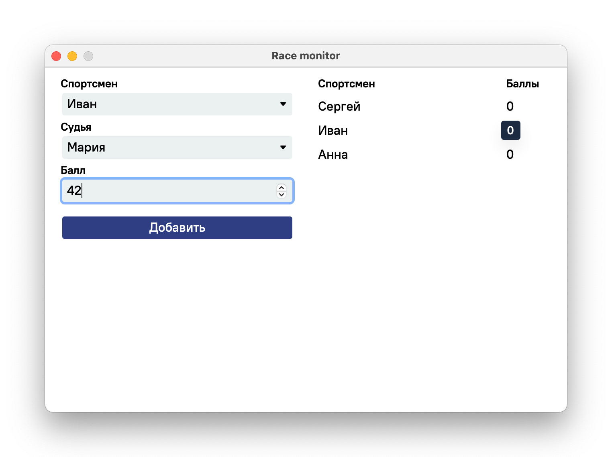

# Race monitor



Приложение отслеживание счёт спортсменов на соревнованиях. Написано на [Wails](https://wails.io/), Go, Javascript и Redis.

## Технические требования

- MacOS 10.5+
- Go 1.21
- Wails 2.60
- Доступ к каппе :-)

## Задание

Реализовать монитор спортивных соревнований.

Спортсмены выполняют упражнения по очереди. За каждое упражнение каждый судья ставит спортсмену оценку, которая прибавляется к его предыдущей сумме. В каждый момент времени отображается информация: упорядоченный по убыванию набранных на текущий момент баллов список спортсменов. Баллы суммируются по всем судьям. Суммарные баллы по каждому спортсмену для каждого судьи хранятся отдельно.

Создать оконное приложение, содержащее раскрывающийся список (для выбора судьи), поле ввода (для ввода баллов), раскрывающийся список (для выбора спортсмена), кнопку (для сохранения баллов), список (для отображения рейтинга спортсменов). Рейтинг спортсменов меняется после ввода новых баллов. Приложение реализует следующие функции:

1. При нажатии кнопки введенные баллы добавляются к баллам выбранного спортсмена и выбранного судьи;
2. При изменении баллов обновляется рейтинг спортсменов.

## Запуск

Прокинуть порт к базе данных на сервере ПетрГУ. Пароль и `<username>` от каппы:

```bash
ssh -L 6379:192.168.112.103:6379 -N -T <username>@kappa.cs.petrsu.ru
```

Запустить приложение в режиме разработки:

```bash
./script/run
```

Или собрать приложение:

```bash
./script/build
```
